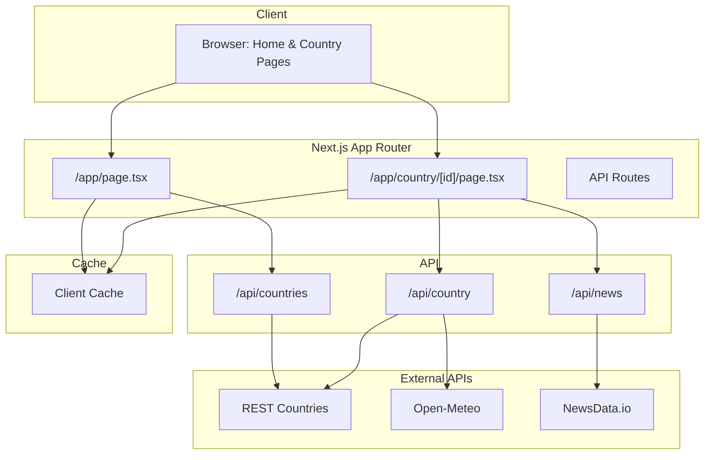

# Global Pulse

A modern, responsive web application that provides comprehensive, real-time information about countries around the world. Search for any country and discover detailed insights including geographic data, weather trends, and the latest news articles.

---

## What Does the App Do?

**Global Pulse** is a comprehensive country information portal that allows users to:

### **Country Search**
- Search for countries
- View up to 10 matching results with key information
- Cached search results for instant repeated queries
- Beautiful card-based UI with country flags, population, capital, area, languages, and currencies

### **Detailed Country Information**
When you click on a country, you get access to:
- **Basic Information**: Official name, population, and flag
- **Geographic Data**: Capital cities and continents
- **Languages**: All spoken languages in the country
- **Currencies**: Official currencies with symbols and codes
- **Weather Analytics**: 7-day temperature trend chart for the capital city
- **Latest News**: Infinite-scroll news feed with articles related to the country

### **Interactive Features**
- **Temperature Chart**: Beautiful SVG-based line graph showing temperature trends over the past 7 days
- **Infinite Scroll**: Automatically loads more news articles as you scroll
- **Client-Side Caching**: Lightning-fast search with memoized results

---

## 🛠️ Tech Stack

### **Frontend**
- **[Next.js 15](https://nextjs.org/)** - React framework with App Router for server and client components
- **[React 18](https://react.dev/)** - UI library with hooks and modern patterns
- **[TypeScript](https://www.typescriptlang.org/)** - Type-safe development
- **[Tailwind CSS](https://tailwindcss.com/)** - Utility-first CSS framework
- **[shadcn/ui](https://ui.shadcn.com/)** - Re-usable component library
- **[Lucide React](https://lucide.dev/)** - Beautiful icon library

### **Backend & APIs**
- **Next.js API Routes** - Server-side API endpoints
- **[REST Countries API](https://restcountries.com/)** - Country data
- **[Open-Meteo API](https://open-meteo.com/)** - Weather data and forecasts
- **[NewsData.io API](https://newsdata.io/)** - Real-time news articles
- **[Open-Meteo Geocoding](https://open-meteo.com/)** - Capital coordinates lookup

### **Key Libraries & Tools**
- **React Hooks** - `useState`, `useEffect`, `useMemo`, `useRef`, `useCallback`
- **Custom Hooks** - `useDebounce` for optimized search
- **Intersection Observer API** - Infinite scroll implementation
- **SVG & Graphics** - Custom-built temperature charts

---

## Solution Architecture



### **Data Flow**

1. **Search Flow**:
   - User types → Debounced input → Check cache → If miss: API call → Store in cache → Display results

2. **Country Details Flow**:
   - User clicks country → Fetch country data → Get capital coordinates → Fetch 7-day weather data → Calculate daily averages → Generate chart → Display with country info

3. **News Flow**:
   - Page loads → Fetch first page of news → User scrolls → Intersection Observer triggers → Fetch next page → Append to list → Repeat

---

## Architecture Decisions

### **Why Next.js over React?**
Next.js was chosen over vanilla React because it provides a complete framework with built-in features like:
- Server-side rendering (SSR) and static site generation (SSG)
- File-based routing with the App Router
- Built-in API routes for backend functionality
- Automatic code splitting and optimization
- Image optimization out of the box

This eliminates the need to install and configure multiple dependencies (routing, SSR, build tools, etc.) that would be required with plain React.

### **Why Next.js API Routes over Backend Frameworks?**
Next.js API Routes were chosen instead of separate backend frameworks (Nest.js/Express/Fastify) because:
- The application primarily consumes third-party APIs (REST Countries, Open-Meteo, NewsData.io)
- No need for complex backend tooling such as database connections, authentication, authorization, or rate limiting
- Simplified deployment with a single codebase
- Reduced infrastructure complexity and costs
- Seamless integration between frontend and backend in one project

### **Why shadcn/ui?**
shadcn/ui was selected for rapid development because:
- Pre-built, accessible components following WCAG standards
- Full customization and ownership of component code
- Faster development compared to building custom components from scratch
- Modern, beautiful UI components with Tailwind CSS integration
- Type-safe with TypeScript support

### **Why Tailwind CSS?**
Tailwind CSS was chosen over SCSS or plain CSS because:
- Utility-first approach speeds up development significantly
- Built-in responsive design utilities for mobile-first development
- Consistent design system with predefined spacing, colors, and typography
- Smaller bundle sizes with purged unused styles
- Better developer experience with IntelliSense support
- Easy to maintain and scale without CSS specificity issues

## Future Improvements

### **Performance Enhancements**
- [ ] Implement **Redis** for server-side caching with TTL
- [ ] Add **React Query** for advanced cache management and background refetching
- [ ] Implement **Image optimization** for country flags and news thumbnails
- [ ] Implement **Code splitting** and lazy loading for route components
- [ ] Implement **Generic** components

### **User Experience**
- [ ] **Advanced Filters** - Filter by region, population range, language, etc.
- [ ] **Sorting Options** - Sort search results by name, population, area
- [ ] **Keyboard Navigation** - Full keyboard support for accessibility

### **Technical Improvements**
- [ ] **Error Boundaries** - Better error handling and recovery
- [ ] **Loading Skeletons** - Improved loading states with skeleton screens
- [ ] **Rate Limiting** - Implement rate limiting for API endpoints
- [ ] **API Response Validation** - Zod schemas for type-safe API responses
- [ ] **Unit Testing** - Jest and React Testing Library
- [ ] **Monitoring** - Sentry for error tracking and performance monitoring
- [ ] **SEO Optimization** - Better meta tags, sitemap, Open Graph tags

### **Design Enhancements**
- [ ] **Animation Library** - Framer Motion for smooth transitions
- [ ] **Accessibility Audit** - WCAG 2.1 AA compliance

---

## 🏃 Getting Started

### Prerequisites
- Node.js 18+ 
- npm or yarn
- NewsData.io API key

### Installation

1. Clone the repository:
```bash
git clone <repository-url>
cd global-pulse
```

2. Install dependencies:
```bash
npm install
```

3. Create `.env.local` file:
```env
NEWS_API_KEY=your_newsdata_io_api_key
```

4. Run the development server:
```bash
npm run dev
```

5. Open [http://localhost:3000](http://localhost:3000) in your browser

---

<div align="center">
  <strong>Built with ❤️ using Next.js and React</strong>
</div>
